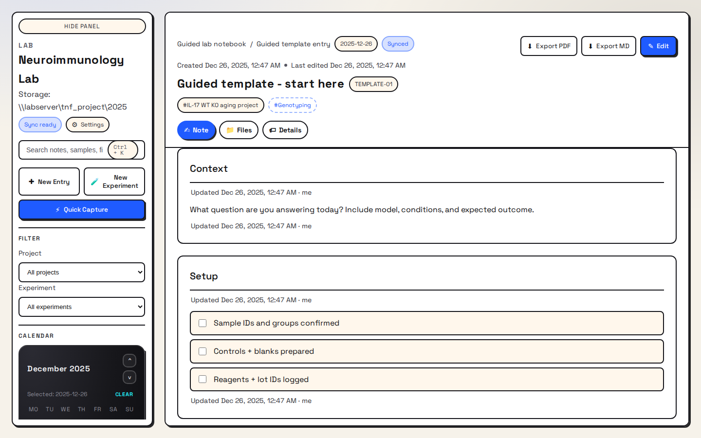
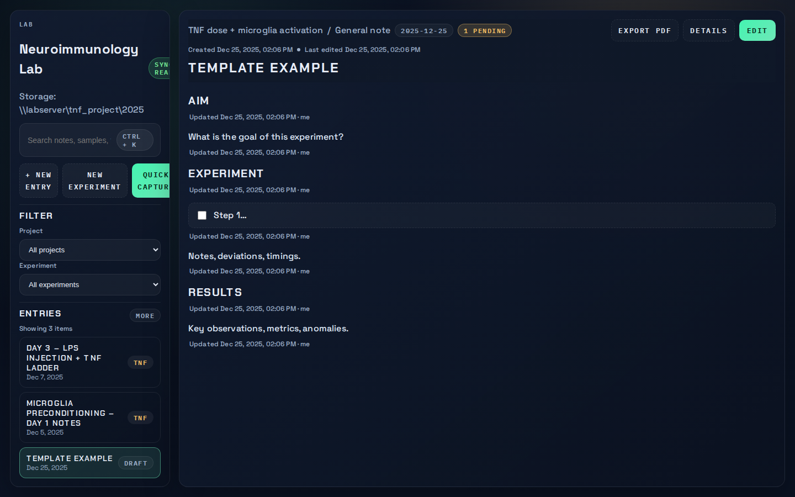
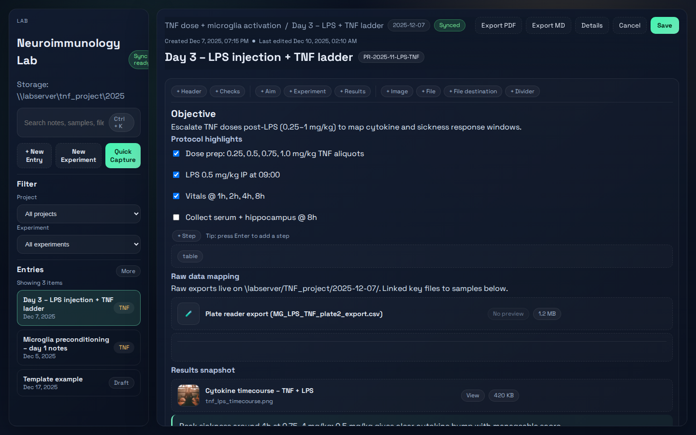
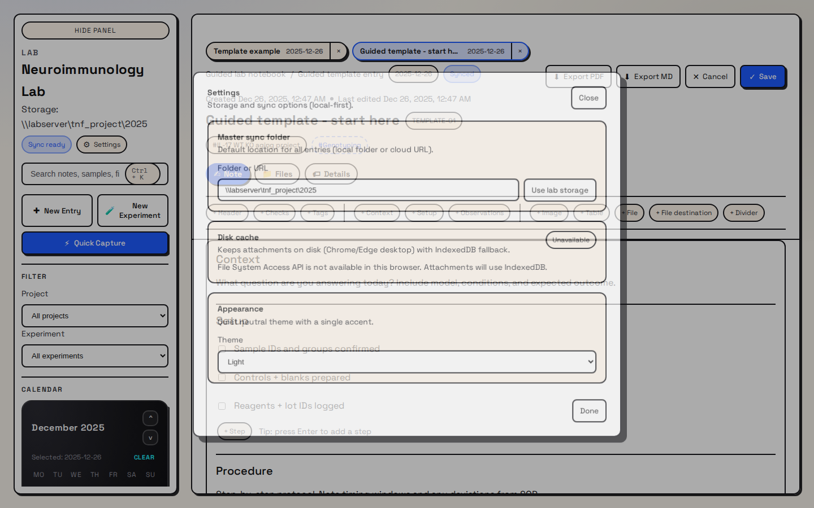
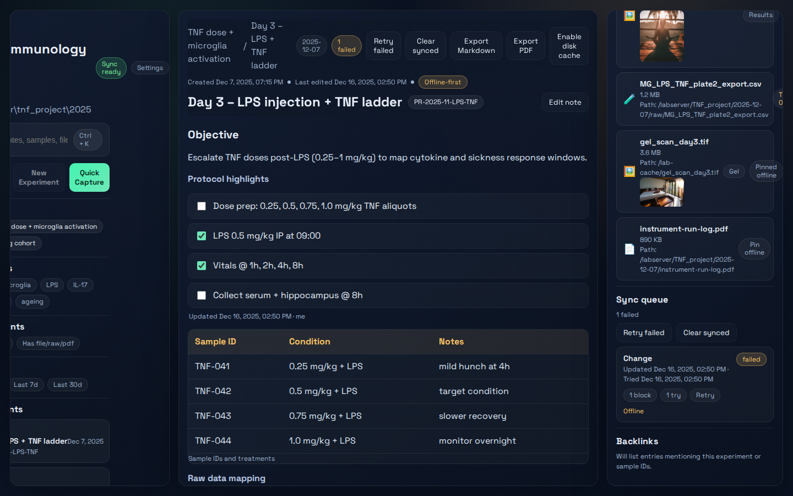
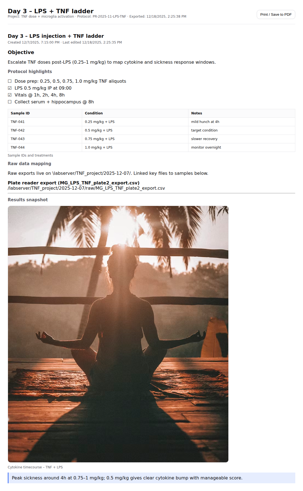

# Lab Note Taking App

Offline-first lab notebook prototype built with React + TypeScript (Vite). Create template-based experiment notes, pin key regions, attach files, export experiments to Markdown or PDF, and track changes in a sync queue with retry.

## Screenshots

| Dashboard | New entry | Template entry |
| --- | --- | --- |
|  |  |  |

| Edit mode | Settings | Sync queue (failed) |
| --- | --- | --- |
|  |  |  |

| Export PDF |
| --- |
|  |

## Features

- **Template notes**: create “Experiment note” templates (Summary / Protocol / Results) with pinned regions.
- **Pinned regions**: quick jump links + attachment linking.
- **Offline-first sync queue**: per-block change queue with `pending / synced / failed`, retry and clear controls.
- **Attachments + cache**: drag/drop/paste attachments with IndexedDB storage, plus optional disk cache via the File System Access API.
- **Export**: Markdown bundle (note + `manifest.json` + attachments paths) and printable PDF export.
- **Search**: fast local search using Lunr.

## Quickstart

### Prereqs

- Node.js 20+ (recommended)
- npm

```bash
npm run dev
```

Open the dev server URL Vite prints (usually `http://localhost:5173`).

Alternative: on Windows, double-click `run-dev.cmd`.

### Playwright browsers (for tests/screenshots)

```bash
cd web
npx playwright install
```

### WSL + mounted drive note

If you work from a mounted Windows drive path like `/mnt/d/...`, `npm install` can fail with `EPERM`/`chmod` errors due to Windows filesystem semantics. The simplest fix is to move the repo into the Linux filesystem (for example `~/projects/...`) before installing.

If you must keep the repo on a mounted drive, one workaround is to install dependencies in the Linux filesystem and symlink `web/node_modules` (this path is gitignored):

```bash
mkdir -p ~/.labnote-modules
cd ~/.labnote-modules
npm init -y
npm install
ln -s ~/.labnote-modules/node_modules "/mnt/d/coding projects/lab note taking app/web/node_modules"
```

## Tests

From `web/`:

```bash
npm run lint
npm run build
npm run test:e2e
npm run screenshots
```

- `npm run test:e2e` runs Playwright end-to-end tests.
- `npm run screenshots` regenerates the PNGs in `screenshots/`.

---

## Product Blueprint

Here’s a structured blueprint for the app. Hand this to a designer + dev team as a working spec.

---

## 1. Concept & Goals

**Goal:** A cross-platform lab notebook that feels like a clean note app, not Excel, but still respects lab structure and makes it easy to find raw files later.

**Key principles:**

* Free-form writing first, structure optional.
* Every note is time-stamped and “lab-grade” (traceable, versioned).
* Attach anything by drag-and-drop or mobile capture.
* Smart search that understands experiments, samples, and files.

---

## 2. Information Architecture & Data Model

### 2.1 Core Entities

1. **User**

   * `user_id`
   * `name`, `email`
   * `role` (PI, student, tech, etc.)
   * `settings` (theme, default lab, default project, etc.)

2. **Lab / Workspace**

   * `lab_id`
   * `name`
   * `members` (list of `user_id` + permissions)
   * `storage_config` (where attachments live: local, S3, institutional drive)

3. **Project**

   * `project_id`
   * `lab_id`
   * `title`, `description`
   * `tags` (e.g., “TNF model”, “microglia”)
   * `archived` flag

4. **Experiment**

   * `experiment_id`
   * `project_id`
   * `title`
   * optional metadata: `protocol_ref`, `animal_model`, `cell_line`, etc.
   * `start_datetime`, `end_datetime` (optional)
   * Relationship: **one experiment has many entries**

5. **Entry (Lab Note)**

   * `entry_id`
   * `experiment_id` (optional; some notes can be “general” or project-wide)
   * `created_datetime` (auto)
   * `last_edited_datetime`
   * `author_id`
   * `title` (optional; default = “Untitled note – [date]”)
   * `date_bucket` (YYYY-MM-DD for calendar grouping)
   * `content` (rich text / block JSON; see below)
   * `tags` (free text + auto-generated)
   * `search_terms` (index fields; auto-extracted)
   * `linked_files` (list of attachment IDs / external URIs)
   * `pinned_regions` (named regions within the note, see below)

6. **Attachment**

   * `attachment_id`
   * `entry_id`
   * `type` (image, pdf, raw data file, table, instrument export, etc.)
   * `filename`
   * `filesize`
   * `storage_path` (local path or cloud URL or network share path)
   * `thumbnail` (for images / pdf)
   * `linked_region_id` (optional: which text region references this attachment)

7. **Block Content Model (for free-form writing)**
   Represent the note as a list of blocks (Notion/Obsidian-style):

   ```json
   {
     "blocks": [
       { "id": "b1", "type": "heading", "text": "Day 3 – LPS injection" },
       { "id": "b2", "type": "paragraph", "text": "Injected 0.5 mg/kg..." },
       { "id": "b3", "type": "table", "data": [[...], [...]] },
       { "id": "b4", "type": "image", "attachment_id": "att_123" },
       { "id": "b5", "type": "checklist", "items": [...] }
     ]
   }
   ```

8. **Pinned Region**

   * `region_id`
   * `entry_id`
   * `block_ids` or text range
   * `label` (e.g., “Summary”, “Protocol”, “Results”, “Raw data mapping”)
   * `linked_attachments` (list of `attachment_id`)

   These regions are what you can “jump to” in search and also where file links live.

9. **Search Index**

   * Separate index for:

     * full text (`content`)
     * tags
     * extracted entities (sample IDs, mouse IDs, gene symbols, etc.)
     * file names and extensions
   * Think of it as a stored search index, not a user-visible entity.

---

## 3. UI Structure

### 3.1 Desktop App Layout

**Top-level layout:**

* **Left sidebar**

  * Lab selector (if multiple)
  * Project list (collapsible)
  * Filters:

    * Calendar view (by date)
    * Tag filter chips
    * Experiment filter
  * Quick actions:

    * “New Entry”
    * “New Experiment”
    * “Quick Capture” (blank note, date-stamped)

* **Main pane (Editor)**

  * Title field
  * Date + time (read-only, editable if needed)
  * Experiment link (“Attach to experiment” dropdown)
  * Block-based editor:

    * Paragraph, heading, checklist
    * Table block (simple inline table editor)
    * Image block (drag-and-drop or paste from clipboard)
    * File block (for non-image attachments)
    * Divider, quote, code, etc.
  * Drag-and-drop anywhere between blocks to insert attachments.

* **Right sidebar (Metadata & Links)**

  * Project / experiment metadata
  * Tags
  * Pinned regions list:

    * Summary
    * Protocol
    * Results
    * Raw data links
  * Attachments panel:

    * Tile view of images
    * List of files with icons
    * Click to open in default viewer
  * Backlinks (entries that reference this experiment or sample ID)

**Aesthetic cues:**

* Light and dark themes.
* Soft rounded cards for notes.
* Subtle accent colors by project.
* Minimal visible chrome; editor feels like a clean sheet.

### 3.2 Mobile App Layout

* **Home screen**

  * Today’s notes (grouped by date)
  * Quick filters: Project, Experiment, Tags.
  * Big “+ Note” and “📷 Capture” buttons.

* **Note view**

  * Same block model but simplified toolbar.
  * Quick insert: text, photo, checklist, table.
  * Take photo directly into entry:

    * Auto-compress and upload.
    * Option to “Mark as raw data / gel image / microscopy”.

* **Offline-friendly**

  * Notes editable offline with local DB.
  * Sync queue visible (small status icon when pending).

---

## 4. Sync & Storage Architecture

### 4.1 Local Storage

* Use a local DB (e.g., SQLite / IndexedDB) to store:

  * Users, labs, projects, experiments
  * Entries and blocks
  * Attachments metadata
* Attachments:

  * Local cache directory.
  * Mark which attachments are “pinned offline” vs cloud only.

### 4.2 Cloud / Server

* **Server DB** stores the same entities.
* Attachments stored in:

  * S3 / object storage or institutional file server.
  * Only metadata stored in DB (paths, hashes).

### 4.3 Sync Logic

* **Offline-first, conflict-handled per block:**

  * Each block has `updated_at` and `updated_by`.
  * Conflict resolution strategy:

    * If two devices edit different blocks, merge.
    * If same block, show a “conflict diff” and let user pick.

* Sync triggered:

  * On change (debounced).
  * On app open / regain network.
  * On manual “Sync now”.

* Version history:

  * Each entry keeps a history of edits with timestamp + author.
  * Option to “View as of [time]” and restore.

---

## 5. Search & Smart Linking

### 5.1 Search UI

* Global search bar (Ctrl+K):

  * Search across:

    * Note title, content
    * Tags
    * Project and experiment names
    * Attachments (file names + OCR text for images/PDFs if enabled)
  * Results grouped:

    * Entries
    * Pinned regions
    * Attachments

* Advanced filters:

  * By date range
  * By project/experiment
  * By tag
  * By attachment type (e.g., “has image”)

### 5.2 Automated Search Terms

When saving an entry, the app can auto-extract:

* **Sample / animal IDs:**

  * Regex rules like `TNF-\d+`, `M\d{3,}` etc (configurable per lab).
* **Molecules / genes:**

  * Dictionary of common genes / markers you define (e.g., IL-1β, TNFα, CX3CR1).
* **Reagent names:**

  * “LPS”, “DAPI”, “PFA”, etc.
* **Instrument IDs:**

  * “QuantStudio 5”, “SP8”, etc.

These become part of `search_terms` and show as clickable chips under the note.

### 5.3 Regions Linking to Files

* Within the note, you can define a **“Raw data mapping” region**.

  * E.g., a small table with columns: Sample ID, File link.
  * Each row stored as structured data behind the scenes.
* Clicking a sample ID:

  * Opens all linked files for that ID.
* From file metadata:

  * See all notes where that file is referenced.

Optionally:

* Add a “Default raw data path” per experiment:

  * e.g., `/labserver/TNF_project/2024-10-14/`.
  * App can auto-append filenames to construct full paths.

---

## 6. Tables, Pictures, Attachments, Drag-and-Drop

### 6.1 Tables

* Simple block:

  * Insert table with rows/cols.
  * No heavy spreadsheet UI, just:

    * Add/remove rows and columns.
    * Basic formatting (bold, italic, alignment).
* Good for:

  * “Mouse ID / Treatment / Time” small tables.
  * Results summary.

### 6.2 Pictures

* Drag-and-drop or paste images:

  * Auto create `image` block + attachment.
  * Option to:

    * Add caption.
    * Add tag (“Gel”, “Slice 10x”, “IF hippocampus”).
    * Link to sample IDs.

* Mobile:

  * “Capture with camera” creates attachment + image block.
  * Minimal steps: snap, auto inserted.

### 6.3 Other Files

* Drag-and-drop `.csv`, `.xlsx`, `.lif`, `.czi`, `.tif`, etc:

  * Stored as file attachment.
  * Show icon + filename.
  * Open with external viewer.

---

## 7. Extra Features That Fit Naturally

### 7.1 Templates

* Per-project or global templates:

  * E.g., “In vivo experiment”, “ELISA run”, “qPCR run”.
* Template defines:

  * Suggested headings: Summary, Objective, Protocol, Results.
  * Default pinned regions.
  * Placeholder text (e.g., “List animals here”).

When you create a note from template, it fills the editor but still feels free-form.

### 7.2 Checklists & Timers

* Checklist blocks for steps:

  * Great for protocols.
* Optional timer per checklist item:

  * Tap “Start timer” on “Incubate 30 min”.
  * Logs start/stop time into the note automatically.

### 7.3 Tagging and Color-coding

* Tags:

  * For conditions (“LPS”, “TNF”, “Saline”).
  * For stages (“planning”, “running”, “analysis”).
* Color coding:

  * Light highlight on notes based on tags in sidebar list.

### 7.4 Export & Sharing

* Export:

  * Single entry to PDF (with inline images and attachment list).
  * Export experiment or project as:

    * PDF bundle
    * Markdown/HTML
    * ZIP of all notes + attachments.
* Share:

  * “Share read-only link” within lab.
  * Permissions: view / comment.

### 7.5 Security & Audit

* Optional features if multi-user / regulated:

  * Audit log: who edited what and when.
  * Lock entries after certain period (e.g., GLP-like mode).
  * Two-factor authentication.
  * Device trust list.

---

## 8. Quick Tech Stack Sketch (optional)

If you ever build this:

* **Client (Desktop/Web):** React + Tauri/Electron for desktop, same codebase in browser.
* **Mobile:** React Native or Flutter.
* **Editor:** block-based (e.g., Slate/ProseMirror custom).
* **Local storage:** SQLite (via better-sqlite3 / SQL.js) or IndexedDB wrapper.
* **Server:** REST or GraphQL API, WebSocket for live sync.
* **Search:** local index (Lunr/Elasticlunr) + server-side full-text (Postgres FTS or Elasticsearch).

---

If you want, next step could be turning this into a more concrete technical spec (DB schema + API endpoints) or into wireframes for the desktop + mobile UI.

---

## Dev prototype (WIP)

A first clickable shell lives in `web/` using Vite + React + TypeScript.

**Run it**

```bash
cd "${PWD}/web"  # /mnt/d/coding projects/lab note taking app/web
npm install       # once
npm run dev -- --host
```

> Note: `node_modules` is symlinked to `~/.labnote-modules` to avoid D: permissions. If you need to reinstall deps: `cd ~/.labnote-modules && npm install`, then ensure `web/node_modules` still points there.
> Production build now writes to `~/.labnote-dist/web` (set in `vite.config.ts`) to avoid D: drive write issues.

What’s in the prototype:

* Three-pane layout (sidebar, editor, metadata) matching the blueprint.
* Sample data seeded in `src/data/sampleData.ts` and domain types in `src/domain/types.ts`.
* Block renderer for headings, paragraphs, checklists, tables, images, files, quotes, and dividers.
* Attachments + pinned regions shown in the right sidebar.

Next build steps you could take:

1) Wire a local database layer (SQLite/IndexedDB) instead of the in-memory sample.
2) Add a block editor (Slate/ProseMirror) to replace the static block renderer.
3) Add search and filters that hit a simple index (lunr / elasticlunr) using `searchTerms`.
4) Add attachment uploader + drop targets that write to a configurable cache dir + cloud bucket mock.
5) Add sync queue + conflict diffing per block (`updated_at`, `updated_by`).

### Prototype features just added
- Client-side search/filter (Ctrl/Cmd+K) across entry titles, tags, content, attachments, pinned region summaries.
- Project and tag chips to narrow the entry list; empty states handled.
- Second sample entry to show filtering.
- Date presets (All / Last 7d / Last 30d) and attachment-type filters (has image, has file/raw/pdf).
- Local search upgraded: lunr-backed full-text across title/tags/body/attachments + filters (project, tags, has-image, has-file/raw/pdf). Keyboard shortcut Ctrl/Cmd+K focuses search.
- Inline editing (Slate) for headings/paragraphs/quotes with Save/Cancel in the editor header; non-text blocks stay read-only placeholders.
- Drafts persist to `localStorage` (`labnote.entries`) so edits survive refresh/offline.
- Drag/drop or paste files into the editor: creates attachments with mock cache paths, previews for images, and a “Pin offline” toggle.
- Attachments + pins are cached in `localStorage` (`labnote.attachments`), and blobs are persisted to IndexedDB (`labnote-cache`) with object URLs for previews.
- Missing cached files show a warning; image attachments display cached previews.
- Filesystem cache (if the browser supports File System Access) is attempted first; otherwise files fall back to IndexedDB blobs.
- Mock sync indicator shows pending changes; a “Sync now” button clears the queue (placeholder for real sync).
